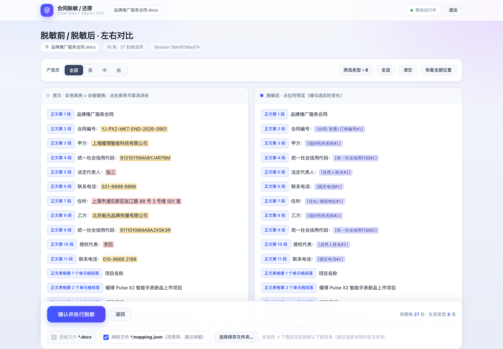

# cece_legal_skills

法务 / 法律场景的**离线小工具**集合。每个项目都可以独立使用，互不依赖。

共同原则：

- **完全离线** —— 不调用大模型、不上传文件、不产生外联流量；
- **结果可复现** —— 依靠格式规则与国标校验位，而不是语义猜测，因此同样的输入永远得到同样的输出；
- **双击即用** —— 每个项目都带 macOS / Windows 启动器，不做技术的人也能用。

---

## 项目列表

### [contract_desensitizer](contract_desensitizer/) —— 合同脱敏 / 还原

把合同里的姓名、手机号、身份证号、银行账号、公司名、金额、地址等敏感信息一键替换成**可逆占位符**
（`[自然人姓名#1]`），需要时再一键还原成原文。还原稿与原文件**逐字一致**，且批注、修订、样式完全保留。

- 支持 `.docx` / `.pdf`（可提取文字版）/ `.txt`
- 内置 27 类识别规则，其中 25 类默认启用
- 同一个实体整篇共用一个编号；企业全称与简称自动归并
- 上传 → 左右对比 → 逐个确认 → 下载，全程在浏览器里点点点

**[→ 查看安装与使用教程](contract_desensitizer/README.md)**

---

## 许可

[MIT](LICENSE) © 2026 whatcccup
