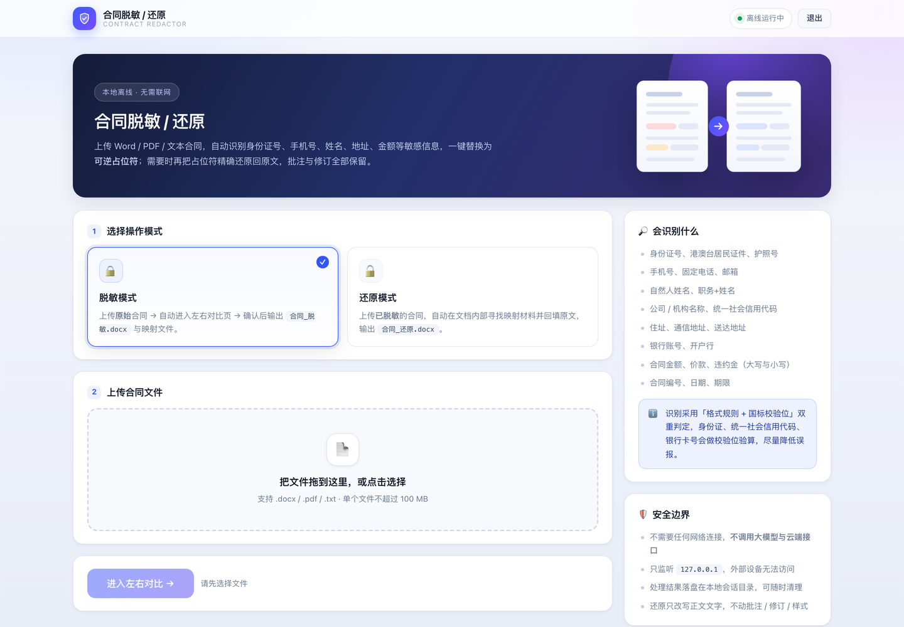
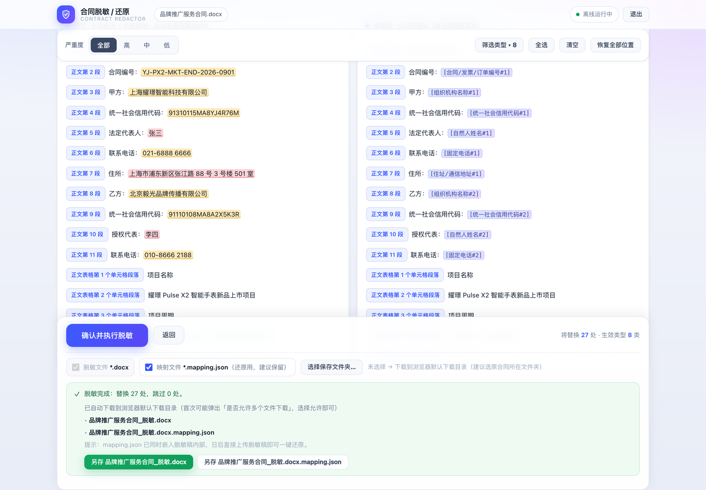

# 合同脱敏 / 还原（Contract Desensitizer）

把合同里的**敏感信息一键替换成可逆占位符**，需要时再**一键还原**成原文。
面向法务、律师、行政、HR 等需要把合同发给外部（对方、外部顾问、投标、归档）的场景。

- **完全离线**：不调用大模型、不调用云端 API、不产生任何外联流量，只监听 `127.0.0.1`
- **可逆**：同一个实体整篇共用一个编号，还原后与原文件**逐字一致**（含表格、页眉页脚）
- **不改原文结构**：还原只改写文字内容，**批注 / 修订 / 样式 / 字体完全保留**
- **支持格式**：`.docx`、`.pdf`（可提取文字的版本）、`.txt` / `.md`
- **不需要 OCR**：扫描件（图片型 PDF）识别不了，请先做 OCR


---

## 目录

- [截图](#截图)
- [安装](#安装)
- [使用](#使用)
- [能识别什么](#能识别什么)
- [如何修改](#如何修改)
- [命令行用法](#命令行用法)
- [目录结构](#目录结构)
- [常见问题](#常见问题)
- [隐私与安全边界](#隐私与安全边界)
- [许可](#许可)

---

## 截图

| 上传与模式选择 | 脱敏完成与保存 |
|---|---|
|  |  |

---

## 安装

### 方案 A（推荐）：把下面这一句话发给 AI Agent

> **请从 GitHub 仓库 `https://github.com/whatcccup/cece_legal_skills` 下载 `contract_desensitizer` 子目录到本地（例如 `~/Documents/contract_desensitizer`），用 Python 3 创建虚拟环境并安装 `requirements.txt` 里的全部依赖，然后确认我可以双击启动器（macOS 为 `launcher/mac/Contract_Redactor.app`，Windows 为 `launcher/windows/Contract_Redactor.vbs`）打开 `http://127.0.0.1:18800/` 完成合同脱敏，全程不要修改源码，装好后告诉我启动方式。**

支持 WorkBuddy、Claude Code、Cursor、Codex 等任何能读写本地文件的 AI Agent。
装完你会得到一个可以双击的图标，之后不再需要任何命令行。

<details>
<summary>如果 Agent 需要更明确的步骤（备选 Prompt）</summary>

> 帮我在这台电脑上装好合同脱敏工具：1) 从 `https://github.com/whatcccup/cece_legal_skills` 取 `contract_desensitizer` 目录，放到 `~/Documents/contract_desensitizer`；2) 用 `python3 -m venv .venv` 建虚拟环境，并 `pip install -r requirements.txt`；3) 跑一次 `python contract_sensitive_detector.py --selftest` 与 `python contract_redactor.py --selftest`，把结果贴给我；4) 告诉我怎么双击启动（macOS 双击 `Contract_Redactor.app`，Windows 双击 `Contract_Redactor.vbs`），以及如果 macOS 提示"无法验证开发者"该怎么处理；5) 不要修改任何源码文件。

</details>

### 方案 B：手动安装

需要 **Python 3.9+**（已在 Python 3.13 上完整验证）与 Google Chrome（可选，用于应用窗口模式）。

```bash
# 1) 取代码
git clone https://github.com/whatcccup/cece_legal_skills.git
cd cece_legal_skills/contract_desensitizer

# 2) 建虚拟环境并装依赖
python3 -m venv .venv
.venv/bin/python -m pip install --upgrade pip          # Windows: .venv\Scripts\python -m pip ...
.venv/bin/python -m pip install -r requirements.txt

# 3) 确认安装成功（两条自检都应输出"通过"）
.venv/bin/python contract_sensitive_detector.py --selftest
.venv/bin/python contract_redactor.py --selftest
```

依赖清单（全部为本地解析 / 渲染库，运行时联网会被主动阻断）：

| 依赖 | 用途 |
|---|---|
| `python-docx` | 解析与改写 `.docx`（段落 / 表格 / 页眉页脚 / 文本框） |
| `pdfplumber` | 解析 `.pdf`，提供词级坐标 |
| `pypdf` | `pdfplumber` 缺失时的降级方案 |
| `reportlab` | 输出 PDF：合成新页并写掩码文字 |
| `pypdfium2` | PDF 栅格化（**真正清掉 PDF 文本层**的关键步骤） |
| `Pillow` | 在栅格化位图上绘制遮罩 |

---

## 使用

### 方式一：双击启动器（推荐）

**首次使用前**（仅 macOS，若被系统拦截）：

```bash
xattr -dr com.apple.quarantine launcher/mac/Contract_Redactor.app
```

之后双击即可：

| 系统 | 双击这个文件 | 说明 |
|---|---|---|
| macOS | `launcher/mac/Contract_Redactor.app` | 无终端窗口，像原生应用 |
| macOS | `launcher/mac/Contract_Redactor.command` | 带终端控制台，排查问题时用 |
| Windows | `launcher/windows/Contract_Redactor.vbs` | 无黑窗口 |
| Windows | `launcher/windows/Contract_Redactor.bat` | 保留控制台 |

启动器会自动完成：**结束上一次的实例**（释放端口 18800、关掉上一次打开的窗口）→ 启动本地服务 →
用 **Chrome 应用窗口**打开 `http://127.0.0.1:18800/`。所以反复双击不会出现"端口被占用"或"开了一堆窗口"。

> 未安装 Chrome 时会自动改用系统默认浏览器。

**停止服务**：点网页右上角「退出」，或再次双击启动器。

### 方式二：命令行启动

```bash
.venv/bin/python contract_app_server.py --port 18800 --workdir ./contract_app_sessions --open-browser
```

### 网页里的五步

1. **选择模式**：`脱敏模式`（把原文变成脱敏稿）或 `还原模式`（把脱敏稿变回原文）。
2. **上传合同**：拖拽或点击选择，支持 `.docx` / `.pdf` / `.txt`，单文件不超过 100 MB。
3. **左右对比**：左栏是原文（彩色高亮 = 会被替换），右栏是脱敏后的样子。
   可按**严重度**（高 / 中 / 低）筛选、按类型勾选、**逐个位置点掉**不想替换的地方。
4. **确认并执行**：点「确认并执行脱敏」。
5. **拿结果**：默认**同时保存两个文件**（见下）。

### 输出文件

| 文件 | 默认 | 用途 |
|---|---|---|
| `xxx_脱敏.docx` | 必选 | 交付给对方的脱敏稿 |
| `xxx_脱敏.docx.mapping.json` | 默认勾选 | 还原用的对照表，建议一并留存 |

保存位置有两种，**优先「选择保存文件夹」**：

- 点「选择保存文件夹…」（建议选**上传合同所在的文件夹**）→ 两个文件直接写进去，不再弹下载框；
  浏览器会记住这个文件夹，下次默认还是它。
- 不选文件夹 → 两个文件自动下载到浏览器默认下载目录
  （Chrome 首次可能提示「是否允许多个文件下载」，允许一次即可）。

> **mapping.json 丢了也不怕**：映射材料同时**内嵌在脱敏稿内部的 `customXml` 里**，
> 之后把脱敏稿拖回本工具就能一键还原。

### 还原

把**脱敏稿本身**上传，选「还原模式」即可 —— 工具会自动找到内嵌的映射材料，
不需要你手工指定 `mapping.json`。还原稿与原文逐段逐格一致。

---

## 能识别什么

内置 **27 类规则**，其中 **25 类默认启用**（`IPV4`、`MAC_ADDRESS` 默认关闭，需要时用 `--enable` 打开）。

| 类别 | 识别内容 |
|---|---|
| 身份标识 | 身份证号（18 位含校验位 / 15 位老版）、护照号、港澳台居民通行证、香港身份证、中国姓名（标签词 + 姓氏表） |
| 联系方式 | 手机号、固定电话（兼容 `0755-8632 9871`、`010-8666 2188`、`(010) 8666 2188`）、400/800 热线、邮箱、详细地址、邮编、微信号 / QQ、车牌 |
| 金融账户 | 银行卡号（Luhn 校验）、银行账号 / 对公账号 |
| 组织主体 | 公司 / 机构名称、统一社会信用代码、税务登记号、营业执照编号 |
| 商业信息 | 合同金额（小写与大写）、合同编号 / 发票号 / 订单号、日期 |
| 法律信息 | 案件号、公文字号 |
| 凭据信息 | API Key、私钥、JWT、口令、cookie（命中即整段替换为 `[已脱敏]`） |

**双重判定**：格式规则 + 国标校验位（身份证、统一社会信用代码、银行卡都会做校验位验算），
尽量压低误报。

两个实际工程中的细节：

- **统一社会信用代码校验位错误时仍会识别**。真实合同里录入错误很常见，只要结构合法
  且有「统一社会信用代码」等上下文标签，就会召回（无标签的 18 位随机串不会误报）。
- **企业全称与简称共用同一个编号**。`北京星海智能科技有限公司（以下简称"星海智能"）`
  与后文出现的 `星海智能` 视为同一主体，编号一致，不会把一份合同拆出几十个编号。

完整规则表（含掩码方式、严重度、正则）见 **[`脱敏规则清单.md`](脱敏规则清单.md)**。

---

## 如何修改

### 加 / 改识别规则：只改 Markdown，不用改代码

`脱敏规则清单.md` 是规则的**唯一配置源**，识别与改写都读它。
在表格末尾追加一行、填上正则即可，改完重跑就生效，复核页也会自动出现新类型：

```
| 28 | EMPLOYEE_NO | 商业信息 | 中 | 员工工号（A+8位数字） | 保留前2后3 | keep_head=2; keep_tail=3 | 是 | 工号\s*[A-Z]\d{8} |
```

推荐用 [AI Agent 帮你改](#方案-a推荐把下面这一句话发给-ai-agent)：
「帮我在 `脱敏规则清单.md` 里加一条规则：识别员工工号，格式是『工号』后跟一个字母加 8 位数字，中严重度，
保留前 2 后 3 位，并跑自检确认没破坏原有识别。」

### 改界面 / 文案：只动一个文件

所有 HTML / CSS / JS 都在 **`contract_app_ui.py`** 里（与后端逻辑完全分离）。
改版时只动这一个文件，不要碰 `contract_app_server.py`。

> ⚠️ 注意：模板用 `__TOKEN__` + `str.replace` 注入变量，**不要**对含 CSS/JS 的模板用
> f-string 或 `.format()`（大括号会被吃掉）。

改完请 `node --check` 检查语法（JS 语法错会导致整页白屏）。

### 改识别 / 改写逻辑

| 文件 | 职责 |
|---|---|
| `contract_sensitive_detector.py` | 识别（候选、报告、占位符编号、简称归并） |
| `contract_redactor.py` | 改写与还原（docx 按 run 级改写；PDF 栅格化） |
| `contract_app_server.py` | Web 服务与路由（纯标准库 HTTP） |
| `contract_app_ui.py` | 全部 HTML / CSS / JS |

### ⚠️ 三条必须遵守的不变量

改代码时最容易踩的三个坑，破坏任何一条都会造成"看着对、其实是错的"：

1. **占位符编号的唯一来源是 `contract_sensitive_detector.EntityNumberer`。**
   编号按 `(类型, 归一化实体名)` 分配，**不是**按出现次数自增。
   它有 **3 个调用点**必须保持一致，否则复核页显示的编号会与产物对不上：
   `write_mapping`、`redact_file`、`_build_review_payload`。
   *（历史教训：早期按 `counter[类型] += 1` 实现，导致同一个人占了几十个编号。）*

2. **还原必须按「出现位置」取原文。**
   一个占位符可能对应多种写法（全称 / 简称、`010-86662188` / `010-8666 2188`），
   所以 mapping 里存的是该次出现的**真实字面文本**，
   还原器用 `load_mapping_sequences()`（按 `start` 排序）跨段落逐个取用。

3. **`report["items"][i]["occurrences"]` 不保证按偏移排序**
   （来自重叠消解的分数排序）。任何"按顺序取用"的逻辑都必须自己按 `start` 排序。

### 改完必跑的回归

```bash
P=.venv/bin/python          # 或你实际使用的 python

$P contract_sensitive_detector.py --selftest      # 识别 + 编号一致性
$P contract_redactor.py --selftest                # 改写正确性
$P tests/test_entity_consistency.py               # 同一实体同一编号 + 还原逐段一致
$P tests/test_app_e2e.py                          # 上传 → 脱敏 → 下载 → 还原 全链路
$P tests/test_output_download.py                  # docx 与 mapping 都能下载；点掉的位置不被替换
node tests/test_save_output.js                    # 保存行为（含写盘失败自动退化为下载）
```

---

## 命令行用法

不用网页也能跑，适合批处理和接入其他流程。

### 识别（生成报告）

```bash
# 生成 json + csv + txt 报告，以及自包含的复查页
python contract_sensitive_detector.py 合同.docx --out-dir ./reports --format json,csv,txt,html

# 只启用部分类型 / 停用某些类型
python contract_sensitive_detector.py 合同.docx --only PERSON_NAME,PHONE_MOBILE
python contract_sensitive_detector.py 合同.docx --disable DATE,AMOUNT

# 强制启用默认关闭的类型，或指定白名单（每行一个值，命中即忽略）
python contract_sensitive_detector.py 合同.docx --enable IPV4,MAC_ADDRESS
python contract_sensitive_detector.py 合同.docx --allowlist allowlist.txt
```

常用参数：`--rules`（指定规则清单）、`--min-confidence`、`--min-severity`、
`--context-chars`、`--no-headers`、`--config`、`--selftest`、`--quiet`。

### 脱敏（命令行）

```bash
# 按类型脱敏，并用占位符 + 写出 mapping.json（可还原）
python contract_redactor.py 合同.docx --types PERSON_NAME,PHONE_MOBILE --restore-mode

# 按复核页导出的 selection.json 脱敏（尊重你逐个点掉的位置）
python contract_redactor.py 合同.docx --selection 合同.selection.json --restore-mode

# 还原
python contract_redactor.py 合同_脱敏.docx --restore
```

### 离线保证

默认强制离线：任何外联请求都会被 `enforce_offline()` 阻断。
只有需要绑定端口的模式（`--serve` / `--app`）才会自动开闸，且只绑定 `127.0.0.1`。
确有需要时用 `--allow-network` 显式放开。

---

## 目录结构

```
contract_desensitizer/
├── contract_sensitive_detector.py   # 识别：候选 → 报告 → 占位符编号
├── contract_redactor.py             # 改写 + 还原（docx / pdf）
├── contract_app_server.py           # Web 服务与路由（纯标准库）
├── contract_app_ui.py               # 全部 HTML / CSS / JS
├── 脱敏规则清单.md                   # ★ 规则唯一配置源，改规则只动这里
├── requirements.txt
├── launcher/
│   ├── mac/                         # .app（双击即用）/ .command（带终端）
│   └── windows/                     # .vbs（静默）/ .bat（带控制台）
├── tests/                           # 回归测试（含前端 JS 测试）
└── docs/images/                     # README 截图
```

运行时会生成（已在 `.gitignore` 中忽略，可随时手工删除以释放空间）：

- `contract_app_sessions/<会话ID>/` —— 每个上传文件一个独立子目录
- `sensitive_reports/`、`*.mapping.json`、`*_脱敏.*`、`*_还原.*`、`*.redaction.log`

---

## 常见问题

| 现象 | 处理 |
|---|---|
| 双击 `.app` 没反应 | 先执行 `xattr -dr com.apple.quarantine launcher/mac/Contract_Redactor.app`；或改用 `.command` 看报错 |
| 提示"找不到 python3" | macOS：`brew install python`；Windows：从 python.org 安装并勾选 *Add Python to PATH* |
| 页面打不开 | 看 `~/Library/Logs/ContractRedactor/server.log`，或改用 `.command` 观察输出 |
| 端口 18800 被占用 | 启动器会自动结束占用者；若占用者是重要程序，请改端口后再启动 |
| 依赖装不上 | 手动执行 `pip install -r requirements.txt` |
| macOS 安全拦截 | 「系统设置 → 隐私与安全性」→ 仍要打开 |
| Windows SmartScreen 拦截 | 「更多信息 → 仍要运行」 |
| 刷新后"选择保存文件夹"失效 | Chrome 的目录授权只在当前页面有效，重新点一次即可（文件夹本身会被记住） |
| PDF 识别不到内容 | 扫描件（图片型 PDF）不含文字层，请先做 OCR |
| 某个号码 / 机构名没识别出来 | 优先检查它前后有没有标签词（如"统一社会信用代码"、"电话"）；仍不行就在 `脱敏规则清单.md` 里加规则 |
| 只想由 0/8 组成的号码（如 `8008008888`） | 无分隔符时会被防误报规则当作占位数据剔除；写成 `800 800 8888` 可正常识别 |

---

## 隐私与安全边界

- 所有解析与改写**都在本机完成**，文件不外传；
- 服务只监听 `127.0.0.1`，局域网内其他设备无法访问；
- 不调用大模型，不调用任何云端 API；
- 识别依靠**格式规则 + 国标校验位**，不是语义理解，因此：
  - 好处：结果**可复现、可审计**，同样的输入永远得到同样的输出；
  - 代价：没有标签词、格式又不规则的敏感信息可能漏检。**脱敏稿交付前请人工过一遍复核页。**

---

## 许可

[MIT](LICENSE) © 2026 whatcccup
